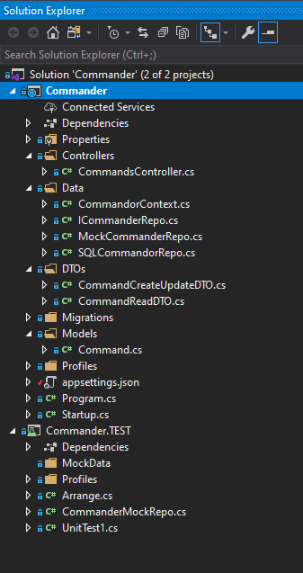
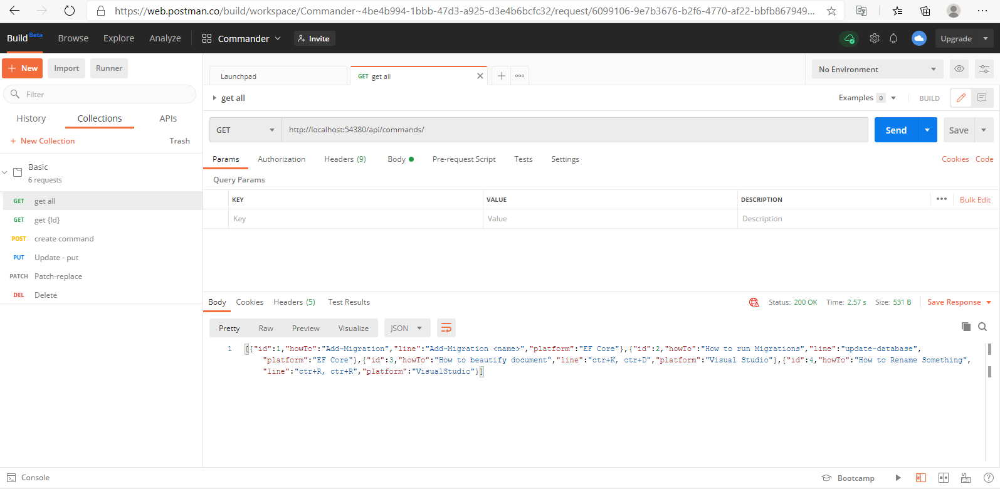

# Commander
> Comander is an ASP.NET CORE 3.1 REST API that manage (CRUD) the list of commands to various platforms 

## Table of contents
* [General info](#general-info)
* [Screenshots](#screenshots)
* [Technologies](#technologies)
* [Setup](#setup)
* [TODO](#TODO)
* [Status](#status)
* [Inspiration](#inspiration)

## General info
It serves as endpoint for a notepad of commands, now can by using only directly through the postman, didn't make any endpoints for it yet.
Commander have basic CRUD operations, no authorisation/authentication it is simply for personal use although I tried to put it in azure platform it was even connected to piplines CD,
but it turned out to be much more complex place, didn't want to dive into it, no need for my career skills.

Example data: 
{"id":1,"howTo":"Add-Migration","line":"Add-Migration ","platform":"EF Core"}

## Screenshots

## Technologies
* AutoMapper.Extensions.Microsoft.DependencyInjection" Version="8.1.0"
* Microsoft.AspNetCore.JsonPatch Version="3.1.9"
* Microsoft.AspNetCore.Mvc.NewtonsoftJson Version="3.1.9"
* Microsoft.EntityFrameworkCore Version="3.1.9"
* Microsoft.EntityFrameworkCore.Design Version="3.1.9"
* Microsoft.EntityFrameworkCore.SqlServer Version="3.1.9"
* Microsoft.EntityFrameworkCore.Tools Version="3.1.9"
* moq Version="4.14.7" />

## Setup
Now it runs on localhost with SqlServer also locally.
This project was configured for Continous Development (Azure Pipelines), now i take it all back leaving only Continous Integration.
Pipelines YML part for CD is commented and Pipelines itself set to manual develop.
Azure Platform release produce 500 error, didn't find cause of this problem, not enough time :(

## Code Examples

Nice usage of JsonConvert:
It serializes objects to Json string so C# put them in one String object and equals can check only content of objects and you don't have to override equals

public class UnitTest1{
public UnitTest1(){
arrange = new Arrange();
_repo = arrange.getRepo();
_mapper = arrange.getMapper();
commands = arrange.getCommands();
}

Arrange arrange;
private static Mock _repo;
private static IMapper _mapper;
private Command[] commands;

[Fact]
public void Test1()
{
CommandsController controller = new CommandsController(_repo.Object, _mapper);
//Act
var ar = controller.GetCommandById(0).Result as OkObjectResult;
CommandReadDTO commandDTOFromController =(CommandReadDTO) ar.Value;
Command commandFromController = _mapper.Map(commandDTOFromController);
Command commandFromArray = commands.FirstOrDefault(a => a.Id == 0);
var commandFromControllerSerialized = JsonConvert.SerializeObject(commandFromController);
var commandFromArrayDeserialized = JsonConvert.SerializeObject(commandFromArray);

//Assert
Assert.Equal(commandFromControllerDeserialized, commandFromArrayDeserialized);
}
}`

## TODO

To-do list:
* Publish
* Make endpoint (Web and Android Application)

## Status
Project is: _in progress_

## Inspiration
Made with few videos from 
Les Jackson
I put it in Inspiration not Source for reason, I always first watch then try to implement code myself.